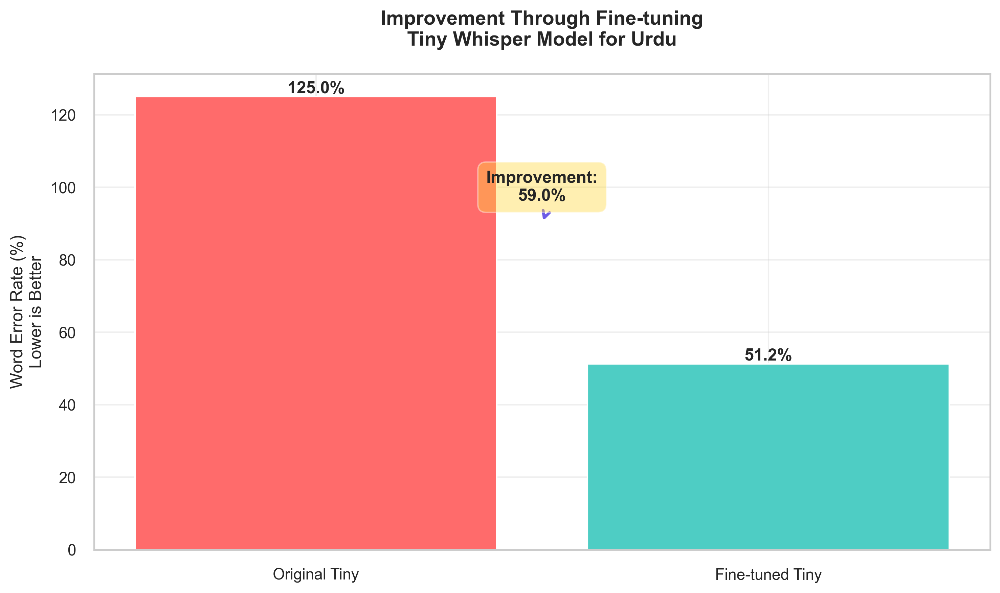
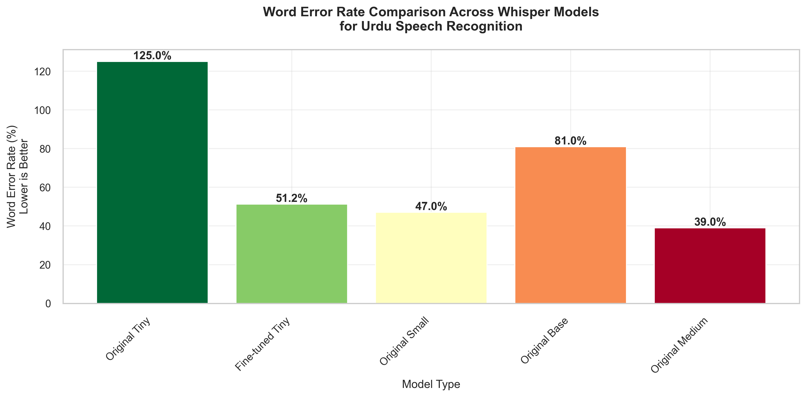

# WhisperMini: Fine-Tuning Whisper for Urdu ASR

**WhisperMini** is a fine-tuned and optimized version of OpenAI’s Whisper ASR model, developed to improve Urdu speech transcription in low-resource environments such as call centers and mobile devices.

## Project Highlights

* Fine-tuned `whisper-tiny` on Urdu (Mozilla Common Voice)
* Reduced Word Error Rate (WER) from 125.0% to 51.2%
* Outperformed the original `whisper-base` (WER 81.0%)
* Applied dynamic quantization for reduced memory usage and faster inference
* Model hosted on Hugging Face:
  👉 [osman31/whisper-tiny-urdu-v1](https://huggingface.co/osman31/whisper-tiny-urdu-v1)

---

## Visual Results

### Training Visualizations


### Comparison Metrics




---

## Model Performance

| Model          | Original WER | Fine-Tuned WER |
| -------------- | ------------ | -------------- |
| Whisper-Tiny   | 125.0%       | 51.2%          |
| Whisper-Base   | 81.0%        | —              |
| Whisper-Medium | 39.0%        | —              |

* Quantization led to 64% memory reduction and 30% faster inference
* Exported to ONNX for compatibility and deployment

---

## Live Frontend Demo

A Gradio-based app is included in the repo to compare transcriptions between:

* Fine-tuned Whisper-Tiny (Urdu-optimized)
* Original Whisper-Tiny (zero-shot)

**Run:**

```bash
python frontend.py
```

**Features:**

* Accepts microphone input
* Displays side-by-side Urdu transcription results
* Auto-detects GPU for accelerated inference

---

## Folder Structure

* `frontend.py` – Gradio comparison UI
* `visualizations/` – Training and evaluation charts

---

## Future Work

* Support for Urdu-English code-switching and regional dialects
* Further compression via pruning
* Deployment on edge hardware (Jetson, Android)

---

## Authors

* Mohammad Osman
* Nayyera Wasim
* Fatima Ghafoor
